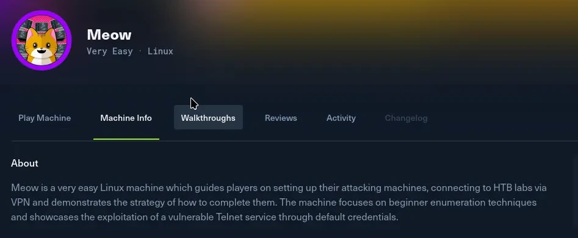
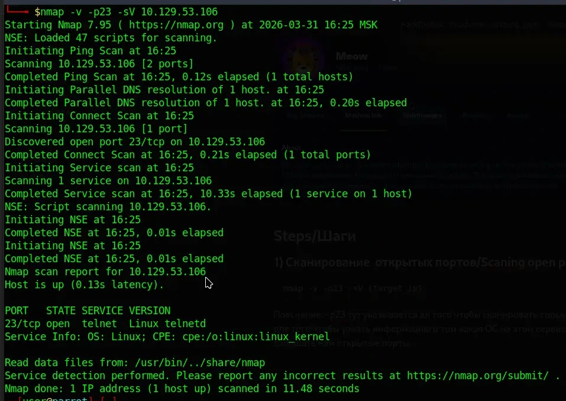
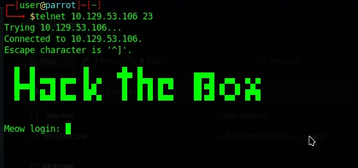
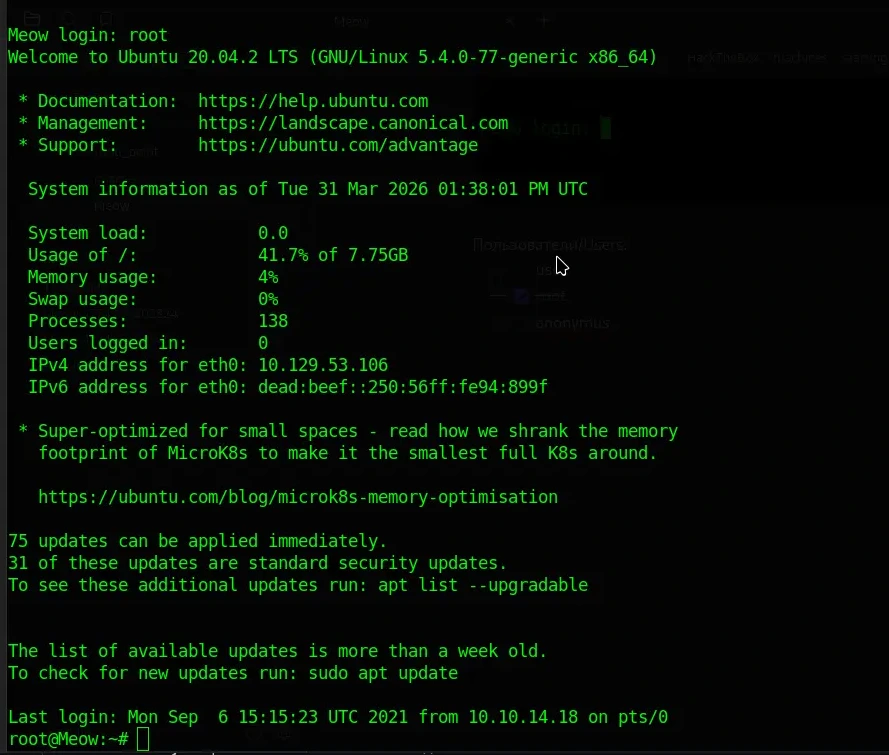
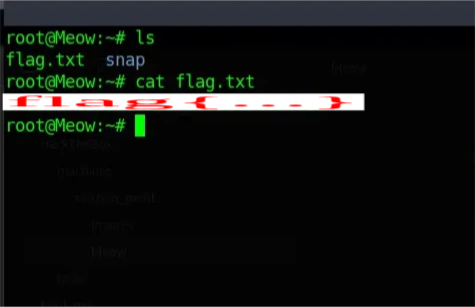

# [HackTheBox](https://hackthebox.com) | [Meow](https://app.hackthebox.com/machines/Meow) 

| **Property**   | **Value**  |
| -------------- | ---------- |
| **Machine**    | Meow       |
| **Difficulty** | Very Easy  |
| **OS**         | Linux      |
| **Date**       | 31.03.2026 |



# Steps/Шаги
### 1) Сканирование  открытых портов/Scaning open ports
```
nmap -v -p23 -sV {target_ip}
```
Пояснение: -p23 тут указывается для того чтобы сканировать только конкретный порт 23. -sV - для того чтобы узнать информацию о том какая ОС на этом сервисе стоит.  -v для того чтобы сообщать нам открытые порты без ожидания результата.



### 2) Подключение к сервису/Connecting to the service
```
telnet {target_ip} port
```




Пользователи/Users:
 1) [ ] user
 2) [x] root
 3) [ ] anonymus




### 3) Получение флага/Confirm flag



