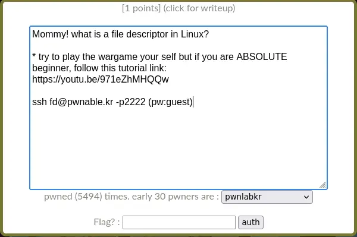
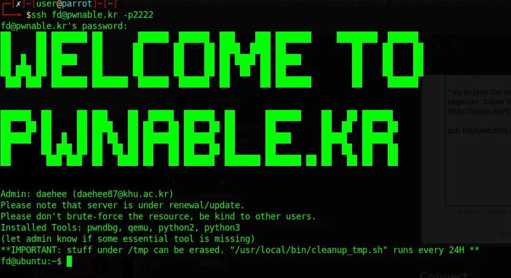
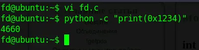
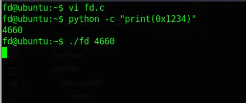
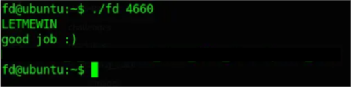
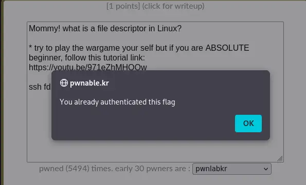

# [pwnable.kr](https://pwnable.kr) | [fd](https://pwnable.kr/play.php)

# Description


# Connect
```
ssh fd@pwnable.kr -p2222
```

```
password: guest
```
# Answer
Посмотрим на код: 


Мы видим что у нас есть функция main, которая в свою очередь принимает агрументы(некий пароль). Что нам нужно сделать? В глаза сразу бросается переменная:

```
int fd = atoi( argv[1] ) - 0x1234
```

Что она значит? Функция atoi берет первый передаваемый аргумент в программу и вычитает из него 0x1234. Что такое 0x1234? Если посчитать это на Python, то у нас будет целое число, давайте попробуем: 
```
python -c "print(0x1234)"
```



Как мы видим у нас получилось число 4660. Что дальше? Дальше мы просто передаем это число в программу и посмотрим что получится.




Дальше нам просто нужно ввести <b>LETMEWIN</b> чтобы нам выдали флаг:


Получаем наши заветные баллы:
